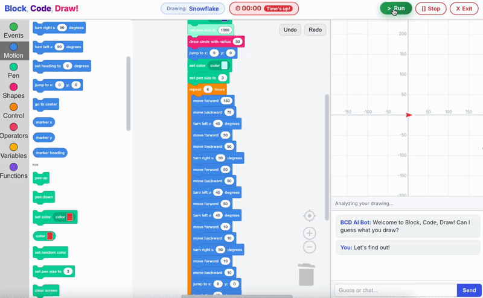

# Block, Code, Draw



Block, Code, Draw is a playful block-based coding game where learners build drawing programs and get AI feedback on what they created.

Live demo: https://kentbrought.github.io/block-code-comp

Created by Kent, Shreya, Terry, and Teresa for CMS.594 at MIT.

## What It Does

- Lets players build drawing logic with Blockly blocks.
- Runs code on a canvas to generate line art and shapes.
- Uses an on-device image classifier pipeline to guess what the player drew.
- Includes a timed classic mode where players try to make the AI guess a secret word.
- Includes challenge mode with intentionally bugged starter code and ghost/reference drawing overlays.
- Includes a guided "How to Play" tour for onboarding.

## Why We Built It

This project explores how generative/AI-assisted learning tools can support beginner programming confidence. The design goal is to keep the interaction creative and low-friction while still teaching core computational ideas like sequence, loops, conditions, and debugging.

## Core Learning Ideas

- Code runs in sequence.
- Loops create patterns efficiently.
- Conditionals enable rules and branching behavior.
- Variables track changing state.
- Debugging is a creative, repeatable process.

## Tech Stack

- React (Create React App)
- Blockly + custom blocks/toolbox
- TensorFlow.js + `tfjs-tflite`
- MediaPipe Tasks Vision utilities
- Reactour for the onboarding tour

## Project Structure

- `src/App.js`: main game flow, screen state, timer, run/stop behavior.
- `src/components/BlocklyEditor.js`: Blockly workspace and block definitions.
- `src/components/DrawingCanvas.js`: drawing runtime and classifier integration.
- `src/components/ChatWindow.js`: in-game feedback/chat panel.
- `src/pages/HomePage.js`: landing screen and primary entry points.
- `src/pages/AboutPage.js`: project context, demo, and curriculum framing.
- `src/constants/challenges.js`: challenge-mode starter programs and hints.
- `src/model/`: local model files and metadata.
- `public/media/block-code-draw-demo.gif`: gameplay demo asset.

## Run Locally

Prerequisites:

- Node.js 18+ recommended
- npm

Install dependencies:

```bash
npm install
```

Start development server:

```bash
npm start
```

Build for production:

```bash
npm run build
```

## Deployment

This repo is configured for GitHub Pages deployment using the `homepage` field and `gh-pages` script.

Deploy command:

```bash
npm run deploy
```

## Notes

- This is an educational prototype and active class project.
- Model behavior and guesses are imperfect by design and used as part of the learning loop.
